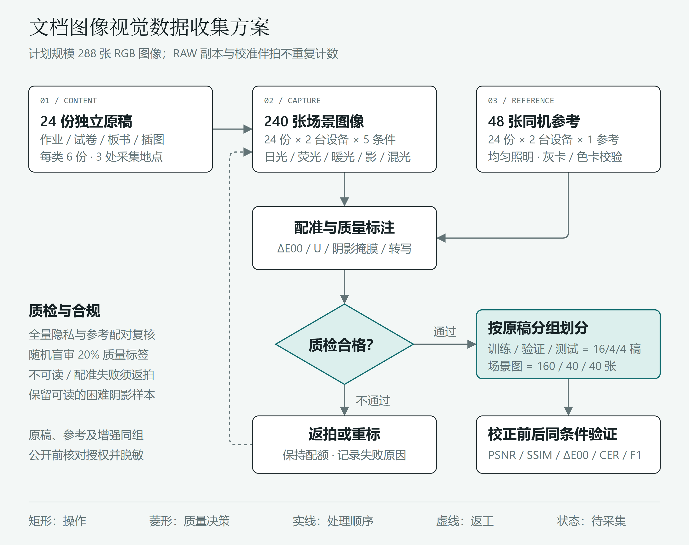

# 文档图像偏色与光照不均：成因、建模与校正

## 摘要

拍照作业中的纸面泛黄、局部阴影与彩色标记失真，会同时影响阅读和自动识别。本文从光源、反射与传感器的耦合出发，梳理统计颜色恒常性、Retinex及深度校正方法，比较其假设、适用条件与失败模式，建立像素、色彩和识别三级评价框架，并提出含240张场景图像与48张配对参考图的小规模采集方案。核心观点是：白平衡不能替代空间照明校正，视觉美化也不等于内容保真；校正应以笔画、批注及插图语义不变为约束。

关键词：文档图像；颜色恒常性；光照校正；成像物理；视觉数据采集

## 1 引言

手机拍摄使作业数字化更便捷，但窗光与台灯混合、书页弯曲、自身遮挡及自动处理容易产生偏色和亮度梯度。扫描仪也存在灯管老化、通道漂移与照明不均。偏色表现为本应中性的区域出现色相偏移；照明不均则具有空间变化，二者既能独立发生，也常共同出现。简单阈值化可能吞掉浅色铅笔字，强行漂白又会抹去红笔批注。本文以教育文档保真为边界，讨论经典假设如何走向可学习映射，并将方法选择落实到可复核的数据与评价协议。

## 2 成像物理与问题建模

在线性、未饱和条件下，通道响应可写为：

$$
I_c(x)=t\int E(x,\lambda)R(x,\lambda)S_c(\lambda)\,\mathrm{d}\lambda+n_c(x)
$$

其中，光谱辐照度$E$、表面反射率$R$、传感器敏感度$S$共同决定像素，$t$为曝光时间，$n$为噪声。白炽灯通常偏暖，天光随天气变化；色温只概括色度，不能唯一描述光谱，具有相近色温的荧光灯和日光仍可能产生不同颜色响应。纸张荧光增白、彩色油墨和板面镜面反射也会破坏理想漫反射假设。方向性照明、遮挡、距离变化及镜头暗角进一步引入空间非均匀性。

简化模型$I=R\odot L$把观测分为反射与照明，单幅图像无法唯一确定两者，必须加入统计或学习先验。全局对角增益近似适合单光源白平衡，却不足以解释混合光下各处不同的偏色。相机的去马赛克、色彩矩阵、伽马和局部色调映射还会使JPEG偏离线性模型；饱和处的信息已丢失，不能靠校色恢复。

## 3 方法脉络

### 3.1 统计恒常性与Retinex

Gray World以平均反射近似中性为前提，用各通道均值估计照明并施加逆增益[1]。它快速且无需训练，但满页彩色插图、绿色板书背景会违反假设。White Patch以各通道高亮响应近似白反射，适合存在可靠白纸的场景；高光、曝光裁剪或彩色亮块会使估计失真，稳健百分位也不能替代对中性区域的验证。

Retinex以视觉对相对反射的感知为出发点[2]，常用对数域原图减去平滑背景来近似去除照明，多尺度版本融合不同空间尺度[3]。它能缓解缓慢变化的阴影，却可能在阴影边界产生光晕、放大暗部噪声，或把粗笔画和大色块误判为照明。文档应用宜结合纸面掩膜、边缘保持滤波与有限增益，不能把所有低频成分都当成应删除的背景。

### 3.2 色彩迁移与深度学习

Reinhard等通过匹配颜色空间中的均值与方差完成色彩迁移[4]，属于统计映射而非深度学习；参考图像改变后，目标风格也改变，因此不保证物理色彩正确。这一思路可扩展为网络学习参考风格、查找表或非线性映射，但训练目标必须从“好看”转向内容与颜色保真。

FC4对局部光照估计学习置信度权重，再汇聚为全局照明[5]，缓解单一局部区域证据不足的问题；全局输出仍难直接处理空间混光。Deep White-Balance Editing学习已渲染sRGB图像的白平衡映射[6]，针对相机非线性处理后简单通道缩放失效的问题。DocTr将几何展开与光照校正分别建模[7]，说明文档任务需要同时关注形变和阴影，但其光照模块不能因此被视作传感器级色彩标定。

学习方法可用配对重建、结构及颜色损失约束，并用平滑照明先验限制任意改写。风险来自设备域偏移、参考误差和训练内容偏置，尤其可能误删浅笔迹。小样本更适合评估预训练网络或有限微调；大模型从零训练不可行，合成偏色也不能完全代替真实混光。

## 4 对比讨论与质量评估

方法选择首先取决于退化：均匀偏色优先验证中性区域与全局增益；空间阴影需要局部照明估计；已渲染图像及复杂耦合可引入学习模型。统计方法解释性强、成本低，但依赖场景假设；Retinex无需成对训练，却容易混淆背景与内容；深度方法表达力强，但泛化依赖数据分布，推理成本也更高。应保留不校正基线，分别测试白平衡、去阴影及联合校正，避免把几何改善误记为颜色收益。

配对图像需先配准，在固定有效区域与相同色彩空间内比较。归一化像素的PSNR关注逐像素误差，其表达式为：

$$
\operatorname{PSNR}=10\log_{10}\!\left(\frac{1}{\operatorname{MSE}}\right)\,\mathrm{dB}
$$

SSIM比较亮度、对比度和结构[8]，但高分不保证批注色彩正确。$\Delta E_{00}$采用CIEDE2000[9]，须将图像正确转换到相同白点的CIELAB，并报告色卡、纸面与彩色内容的分区结果。另统计中性块亮度变异系数及OCR字符错误率，检查笔画保持。无配准参考时不报告全参考分数；照片参考仅是可重复的操作目标，不是绝对反射率真值。

## 5 视觉数据收集方案

### 5.1 对象、规模与合规

计划自行制作作业、试卷、可移动板书和教学插图各6份，共24份独立原稿，在教室、书房和实验室均衡分配。每稿用两台不同品牌手机，在漫射日光、荧光灯、白炽灯、侧光遮挡、日光与暖灯混合五种条件下各拍一次，得到$24\times2\times5=240$张；另为每稿每设备拍一张参考，共48张，总计288张，RAW副本不重复计数。此为待执行计划，不代表已采集。

优先使用原创题目及绘图；真实作业须先获作者与必要监护人同意，遮蔽姓名、学号、成绩和人脸，发布副本移除定位元数据。教材图片未经许可不上传。FiveK含自然照片及专家审美修图[10]，只能按其逐文件许可作为可选预训练来源，不能当作文档校色真值；LoDoPaB-CT是断层重建数据，与本任务不匹配，故不纳入。公开仓库仅发布方案、空白模板及经审查的可公开材料。

### 5.2 拍摄与配对参考

固定支架与距离，保留完整边界；每组锁定焦点、曝光和固定白平衡，关闭美颜及可关闭的HDR，记录设备、灯型、曝光、地点和原稿编号，无法关闭的处理单独标记。调节灯距或功率避免裁剪，支持时同时保留RAW与原始JPEG。参考采用均匀高显色照明、灰卡白平衡及色卡校验，同机同位拍摄并保持纸面形状不变。边缘设置八个中性灰块，另以同平面均匀灰板检查中心照明；校准伴拍不计入288张。用定位点配准并人工复核，指标计算时裁去标记与色卡，保留各方法一致的内容区域。

### 5.3 标注、质检与执行

以灰块相对参考的$\Delta E_{00}$中位数记录偏色，暂分为小于3、3至8、超过8三级，同时保存连续值。该分数含明度影响，需结合$a^*$、$b^*$偏移和人工色相标签解释。令$q_i$为第$i$块线性亮度与参考亮度之比，以$U$记录不均匀性：

$$
\begin{aligned}
q_i&=\frac{Y_i^{\mathrm{scene}}}{Y_i^{\mathrm{ref}}},\quad i=1,\ldots,8,\\
U&=\frac{\operatorname{std}(q_1,\ldots,q_8)}{\operatorname{mean}(q_1,\ldots,q_8)}.
\end{aligned}
$$

暂以0.05和0.15分级；边缘采样不能发现所有内部阴影，故另画阴影掩膜并检查伴拍灰板。无RAW时逆sRGB仅作相对近似。阈值仅为项目约定，先用20张预试拍校准。

主标注员全量标记，复核员检查全部隐私、参考配对及失败样本，并随机盲审20%的质量标签；分歧共同裁决，记录一致率。内容被裁、笔画不可辨、有效区饱和比例超过1%或定位点残差超过2像素时返拍；故意采集的可读阴影不因难度高而剔除。另保存文本转写、区域框、批注颜色、授权与质检状态。两人使用借用手机、灯具和色卡，预计四天完成预试、采集、标注与审计，耗材预算不超过500元。

### 5.4 下游验证与划分

按原稿而非照片分组，各类按4/1/1份划入训练、验证、测试，得到16/4/4份原稿及160/40/40张场景图；所有设备、光照、参考与同模板增强版本跟随原稿，防止内容泄漏。固定OCR与版面模型，对校正前后报告字符错误率及区域检测F1，按设备、光照、内容分层汇总；附原稿级重采样区间并承认测试原稿仅4份的局限。学情分析仅评估答案提取是否更可靠，不据图像质量推断学生能力，也不预设准确率必然提升。图1给出流程与质检回路。

## 6 结论

文档校正是受成像约束的保真重建，而非简单漂白。经典方法提供可解释基线，深度模型补充复杂映射，但可靠结论仍依赖同机参考、分组划分及任务级检验。所提方案以可控规模连接物理观测、质量标注和识别验证，为后续实证研究提供起点。

## 参考文献

[1] Buchsbaum G. A spatial processor model for object colour perception[J]. Journal of the Franklin Institute, 1980, 310(1): 1-26. DOI: 10.1016/0016-0032(80)90058-7. [来源](https://doi.org/10.1016/0016-0032(80)90058-7)

[2] Land E H, McCann J J. Lightness and Retinex Theory[J]. Journal of the Optical Society of America, 1971, 61(1): 1-11. DOI: 10.1364/JOSA.61.000001. [来源](https://doi.org/10.1364/JOSA.61.000001)

[3] Jobson D J, Rahman Z, Woodell G A. A multiscale retinex for bridging the gap between color images and the human observation of scenes[J]. IEEE Transactions on Image Processing, 1997, 6(7): 965-976. DOI: 10.1109/83.597272. [来源](https://doi.org/10.1109/83.597272)

[4] Reinhard E, Ashikhmin M, Gooch B, Shirley P. Color transfer between images[J]. IEEE Computer Graphics and Applications, 2001, 21(4): 34-41. DOI: 10.1109/38.946629. [来源](https://doi.org/10.1109/38.946629)

[5] Hu Y, Wang B, Lin S. FC4: Fully Convolutional Color Constancy With Confidence-Weighted Pooling[C]. Proceedings of the IEEE Conference on Computer Vision and Pattern Recognition, 2017: 4085-4094. DOI: 10.1109/CVPR.2017.43. [来源](https://openaccess.thecvf.com/content_cvpr_2017/html/Hu_FC4_Fully_Convolutional_CVPR_2017_paper.html)

[6] Afifi M, Brown M S. Deep White-Balance Editing[C]. Proceedings of the IEEE/CVF Conference on Computer Vision and Pattern Recognition, 2020: 1397-1406. DOI: 10.1109/CVPR42600.2020.00147. [来源](https://openaccess.thecvf.com/content_CVPR_2020/html/Afifi_Deep_White-Balance_Editing_CVPR_2020_paper.html)

[7] Feng H, Wang Y, Zhou W, Deng J, Li H. DocTr: Document Image Transformer for Geometric Unwarping and Illumination Correction[C]. Proceedings of the 29th ACM International Conference on Multimedia, 2021: 273-281. DOI: 10.1145/3474085.3475388. [来源](https://doi.org/10.1145/3474085.3475388)

[8] Wang Z, Bovik A C, Sheikh H R, Simoncelli E P. Image quality assessment: From error visibility to structural similarity[J]. IEEE Transactions on Image Processing, 2004, 13(4): 600-612. DOI: 10.1109/TIP.2003.819861. [来源](https://doi.org/10.1109/TIP.2003.819861)

[9] Sharma G, Wu W, Dalal E N. The CIEDE2000 color-difference formula: Implementation notes, supplementary test data, and mathematical observations[J]. Color Research & Application, 2005, 30(1): 21-30. DOI: 10.1002/col.20070. [来源](https://www.ece.rochester.edu/~gsharma/ciede2000/)

[10] Bychkovsky V, Paris S, Chan E, Durand F. Learning photographic global tonal adjustment with a database of input/output image pairs[C]. Proceedings of the IEEE Conference on Computer Vision and Pattern Recognition, 2011: 97-104. DOI: 10.1109/CVPR.2011.5995413. [来源](https://data.csail.mit.edu/graphics/fivek/)

## 图1 视觉数据收集方案

